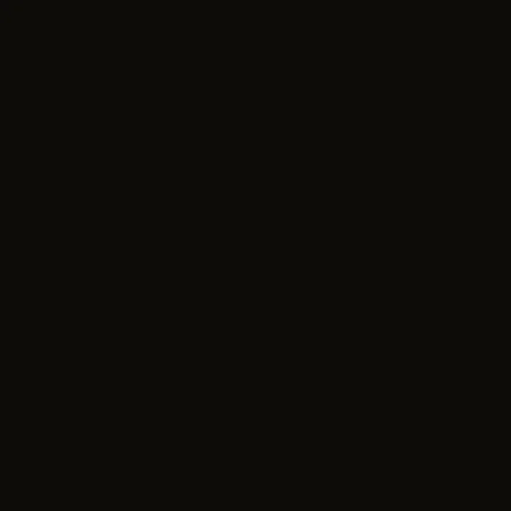

# MontageSubs · Brand Assets

蒙太奇字幕组品牌资产 · 用爱发电 ❤️ Powered by Love

---

## 立刻能用

| 我想要 | 用这个 |
|---|---|
| 深色页面 / 视频片头 / app dark icon | [`logos/master/m-mark-dark.png`](logos/master/m-mark-dark.png) |
| 浅色页面 / 网站 hero / 浅底文档 | [`logos/master/m-mark-light.png`](logos/master/m-mark-light.png) |
| 圆形社媒头像（Discord / Telegram / 微信） | [`logos/master/m-mark-light-circle.png`](logos/master/m-mark-light-circle.png) |
| 网站 favicon | [`logos/favicon/`](logos/favicon/) — 含 `.ico` + 11 种尺寸 PNG + `manifest.webmanifest` + HTML snippet |
| 视频台标 / 字幕水印 | [`applications/video-bug/`](applications/video-bug/) |
| PPT 封面 | [`applications/ppt-cover/`](applications/ppt-cover/) |
| 名片 / 信纸 | [`applications/stationery/`](applications/stationery/) |
| 霓虹通电动效（片头 / 网页） | [`applications/animated/animated-neon-on.svg`](applications/animated/animated-neon-on.svg) |
| 单色印刷 / 绣花 / 激光 | [`logos/mono/`](logos/mono/) — 10 个矢量单色变体 |
| Lockup 字标（M + 名字） | [`logos/lockup/`](logos/lockup/) |

完整品牌规范：[`guidelines/BRAND.md`](guidelines/BRAND.md)

---

## 目录结构

```
brand-assets-main/
├── README.md                     ← 你正在看
├── logos/
│   ├── master/                   ⭐ 锁定的 master logos（dark + light）
│   │   ├── m-mark-dark.{png,svg}             深色 master（源照片，0 处理，2560×2560）
│   │   ├── m-mark-light.{png,svg}            浅色 master（默认 = rounded token）
│   │   ├── m-mark-light-rounded.{png,svg}    深色圆角 token + M
│   │   ├── m-mark-light-circle.{png,svg}     圆形 token + M
│   │   ├── m-mark-light-square.{png,svg}     直角方 token + M
│   │   ├── m-mark-transparent.{png,svg}      透明底版本
│   │   └── m-geom-base.svg                   矢量轮廓基底（给 mono / 动效用）
│   ├── mono/                     单色矢量变体 ×10
│   ├── lockup/                   M + 蒙太奇字幕组 / MontageSubs 字标 ×4
│   ├── favicon/                  16/32/48/64/96/128/180/192/256/384/512 + .ico + manifest
│   ├── png/                      各尺寸位图导出（app / web / hires）
│   └── source/                   原始照片 + 许可证
├── applications/
│   ├── social/                   社媒头像 + 横幅 ×8
│   ├── video-bug/                视频台标 ×3
│   ├── ppt-cover/                PPT 封面（dark + light）
│   ├── stationery/               信纸 + 名片（front/back × dark/light）
│   └── animated/                 霓虹通电动效（SVG SMIL + HTML 演示）
├── guidelines/
│   ├── BRAND.md                  ⭐ 完整品牌手册
│   ├── clearspace.svg            安全间距规范
│   ├── minsize.svg               最小尺寸规范
│   ├── misuse.svg                错误用法（6 种禁止）
│   └── colors.svg                配色规范（11 色 token）
├── legacy/                       老版本资产（不要在新场景使用）
└── preview/                      构建预览页（HTML 自包含）
```

---

## 设计哲学（一句话）

**M 永远住在它的"夜"里。**

霓虹只在黑里才"亮"。把 dark master 的照片直接放白底，halo 和案体阴影会糊成黄雾，霓虹味立刻消失。所以浅色场景**不重新着色 M**——而是给 M 配一个深色 token 作为它的"夜"。三种 token 形态（rounded / circle / square）覆盖几乎所有浅色用途。

详细推理见 [`guidelines/BRAND.md`](guidelines/BRAND.md) §2.2。

---

## 配色

主品牌黄 `#FBC100` ★ — 任何单色复刻必用此色。

完整 11 色 token：见 [`guidelines/colors.svg`](guidelines/colors.svg) 或 BRAND.md §3。

```
#0E0B07  ink-deep       ← dark mode 主背景（不要纯黑 #000）
#1A1410  ink-soft       ← 浅底上的单色 M
#FBC100  yellow ★        ← 主品牌黄
#FAF7EE  mist           ← light mode 主背景（不要纯白 #FFF）
```

---

## 字体

| | 推荐 | Fallback |
|---|---|---|
| CN | 思源黑体 / Noto Sans CJK SC / PingFang SC Medium | `"PingFang SC", "Hiragino Sans GB", "Microsoft YaHei", system-ui` |
| EN | Inter / Helvetica Bold | `"Helvetica Neue", "Helvetica", system-ui, -apple-system, sans-serif` |

---

## 常见用法

### 网站 favicon

```html
<!-- 复制到 <head>，资源放到 /favicon/ -->
<link rel="icon" type="image/x-icon" href="/favicon.ico">
<link rel="icon" type="image/png" sizes="32x32" href="/favicon-32.png">
<link rel="apple-touch-icon" sizes="180x180" href="/apple-touch-icon.png">
<link rel="manifest" href="/manifest.webmanifest">
<meta name="theme-color" content="#0E0B07">
```

完整 snippet：[`logos/favicon/html-snippet.html`](logos/favicon/html-snippet.html)

### Markdown 嵌入动效

```markdown

```

WebP 真照片帧动画（370KB，2.5s，霓虹通电 flicker 序列），现代浏览器/GitHub/Notion 都支持。
其他格式：GIF（3.8MB）/ APNG（5.9MB，无损）/ SVG SMIL / HTML。

### 视频片尾

打开 [`applications/animated/animated-neon-on.html`](applications/animated/animated-neon-on.html) → 浏览器播放 → QuickTime / OBS 屏幕录制 2.5s → 导入 NLE。

### 字幕台标 / 视频水印

[`applications/video-bug/video-bug-yellow.svg`](applications/video-bug/video-bug-yellow.svg) 放视频右下角，距边缘 5%。1080p 推荐 80-120px，4K 推荐 160-240px。

---

## Logo 背景故事

蒙太奇字幕组是一个非营利性的在线字幕社区，成立于 **2025 年 8 月**，致力于连接影视创作者、字幕创作者与全球观众。

本 Logo 最初源于**巴黎地铁入口标志**——黄色 M 灯箱由 RATP（巴黎大众运输公司）于 **1970 年代**采用 [[1]](https://www.ratp.fr/en/discover/coulisses/daily-life/do-you-know-how-paris-metro-signposts-have-evolved)。由于不满足版权保护所需的原创性阈值，该标志属于**公有领域** [[2]](https://en.wikipedia.org/wiki/Threshold_of_originality)。

摄影师 **[Zacharie Elbaz](https://unsplash.com/@zachlba)** 于 **2024 年 10 月 22 日**在巴黎街头拍摄了这张作品，发布在 [Unsplash](https://unsplash.com/photos/the-letter-m-is-lit-up-in-the-dark-GejUCxKwAUw)，采用 Unsplash License。原始作品保存在 [`logos/source/`](logos/source/) 目录。

创始人**小 p** 于 2025 年 9 月下旬将该作品裁剪后用作社群头像，并于 **2026 年 5 月 3 日**进行了完整优化处理（精细裁剪、降噪修复、细节提升、背景处理、矢量化和多色版本等）。

这张街头摄影作品完美诠释了蒙太奇字幕组的品牌定位：

- **M** 代表 Montage（蒙太奇）的首字母，隐含 Movie（电影）的含义
- **黄色霓虹** 象征光影在黑暗中的绽放，寓意字幕的价值与意义
- **黑色背景** 具有电影感与专业氛围，体现影视制作的专业性
- **霓虹美学** 呈现独特的艺术张力，赋予组织强烈的视觉个性

---

## 许可

| 内容 | 许可 |
|---|---|
| `logos/source/`（原始照片） | [Unsplash License](logos/source/LICENSE.md) — 商用 / 非商用自由使用 |
| 其余所有 brand asset 文件 | [CC BY-NC-SA 4.0](LICENSE.md) — 署名 / 非商用 / 相同方式共享 |

---

<div align="center">

**蒙太奇字幕组 · MontageSubs**
用爱发电 ❤️ Powered by Love

</div>
